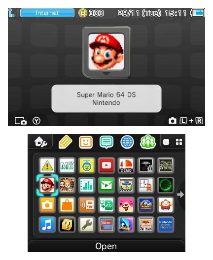
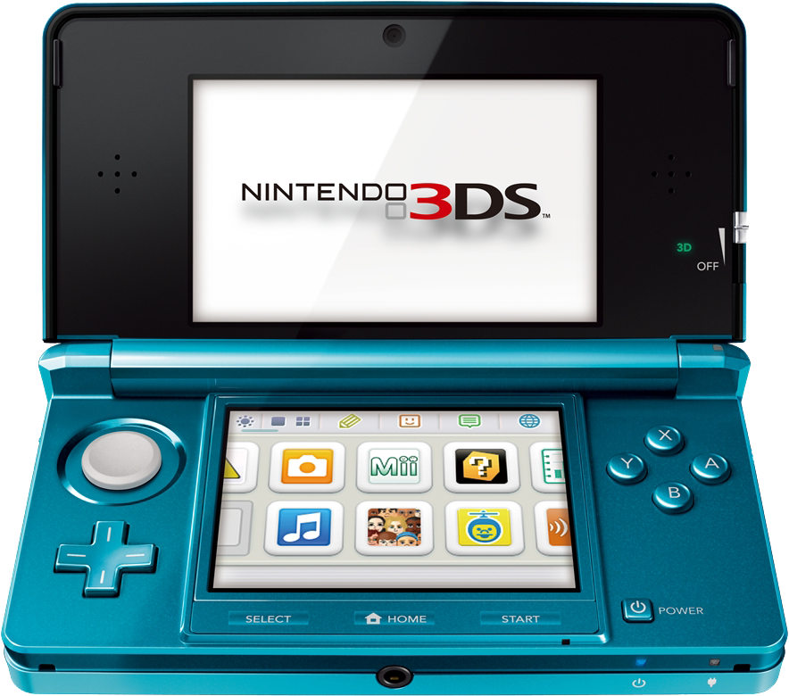
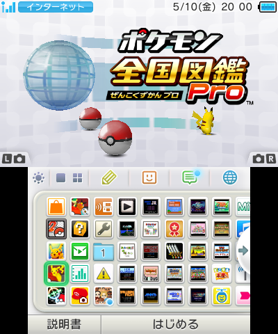

# Nintendo 3DS 标准前端复刻基准

用同一份 Prompt、同一套图片和同一个空白工程，比较模型把视觉参考实现成网页的能力。

**这是测试题仓库，不是复刻成品，也不是任天堂官方基准。** 首轮只做深色 HOME Menu 和蓝色初代 3DS 外观；不做主题切换、模拟器或完整操作系统。

## 最快开始

1. 给每个模型创建独立工程或分支，固定到同一个基准 commit。
2. 安装空白工程：`cd starter && npm ci`。
3. 把 [PROMPT.md](PROMPT.md) 原文发给模型，并真正附上下面三张图片；只发文件名不算提供了图片。
4. 让模型只修改 `starter/`，启动后按 [评测流程](docs/PROTOCOL.md) 截图、操作、打分。

不要把某个模型已经完成的代码再交给另一个模型作为初始工程。

## 三张参考图

| 图 | 用途 | 规则 |
| --- | --- | --- |
| [01-home-dark.png](references/01-home-dark.png) | 默认软件界面 | 深色上下屏、图标顺序和选中态的唯一主视觉基准 |
| [02-hardware-aqua-blue.png](references/02-hardware-aqua-blue.png) | 蓝色初代 3DS 外观 | 屏幕里的宣传内容不参与复刻 |
| [03-home-light-detail.png](references/03-home-light-detail.png) | 软件预览与图标细节辅助 | 不使用其浅色主题、日文、图标排列或宝可梦初始状态 |





此前提供的白色 New Nintendo 3DS／塞尔达主题图不纳入本基准，以免混合型号和主题。

## 测什么

| 维度 | 分值 |
| --- | ---: |
| 蓝色初代 3DS 外壳、双屏及按钮结构 | 25 |
| 深色上屏与软件预览 | 22 |
| 深色下屏、图标网格及选中态 | 23 |
| 细节与移动端等比例适配 | 10 |
| 基础选择、启动占位页与返回交互 | 15 |
| 可运行性、资源本地化及工程交付 | 5 |
| **合计** | **100** |

视觉项占 80 分。具体扣分锚点见 [RUBRIC.md](docs/RUBRIC.md)；截图工具不会自动给出视觉分。

## 工程与评测命令

空白 React + TypeScript + Vite 工程：

```bash
cd starter
npm ci
npm run dev -- --host 127.0.0.1
# 在另一个终端检查构建
npm run build
```

评测者在仓库根目录执行：

```bash
npm ci
npm run check
npm test
npx playwright install chromium
npm run capture -- --url http://127.0.0.1:5173 --out runs/model-a-01/evidence
```

截图脚本使用固定 Chromium 环境：桌面 `1440 × 1000`、移动端 `390 × 844`、DPR 1，保存完整画面、双屏局部及基础交互证据。候选实现需要遵守 Prompt 中的 `data-bench` 标记。没有实现的空白起点会被截图脚本判为不满足要求，这是预期行为。

## 文件入口

- [PROMPT.md](PROMPT.md)：唯一正式中文测试 Prompt，直接复制即可。
- [benchmark.json](benchmark.json)：版本、参考图哈希、截图尺寸、初始状态和评分权重。
- [docs/PROTOCOL.md](docs/PROTOCOL.md)：预算、工具权限、单轮测试和盲评规则。
- [docs/RUBRIC.md](docs/RUBRIC.md)：100 分评分表和无效运行规则。
- [results/template.json](results/template.json)：空白结果记录；未填写项用 `null`，不伪造成绩。
- [references/README.md](references/README.md)：参考图分工和第三方素材权利说明。

建议同一模型至少跑 3 次，分别记录首轮成绩，报告中位数和范围。改变工具、推理强度或预算，应视为不同测试条件，不直接归因于模型本身。

## 权利说明

原创代码、Prompt 和评测文档按 [MIT](LICENSE) 发布。参考图、任天堂商标、游戏图像和其他第三方内容不在 MIT 授权范围内；这些是用户提供的评测参考，原始出处和再分发许可尚未核实。详见 [NOTICE.md](NOTICE.md)。
